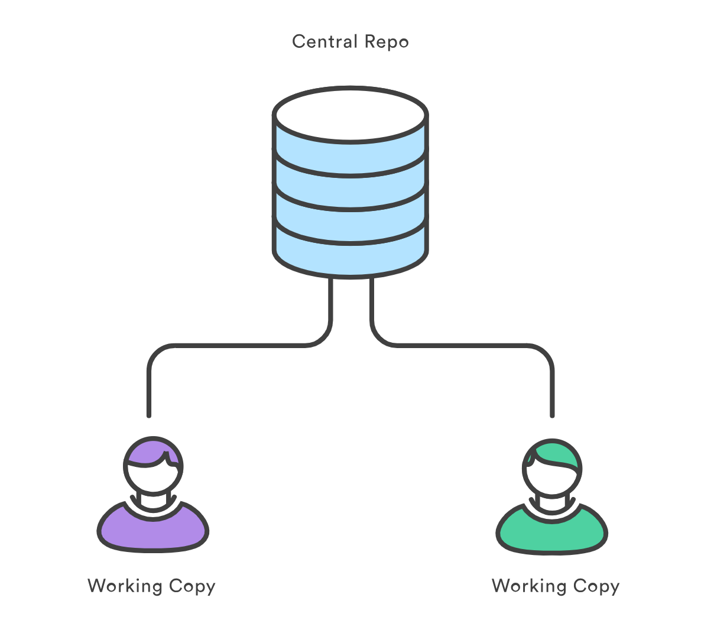
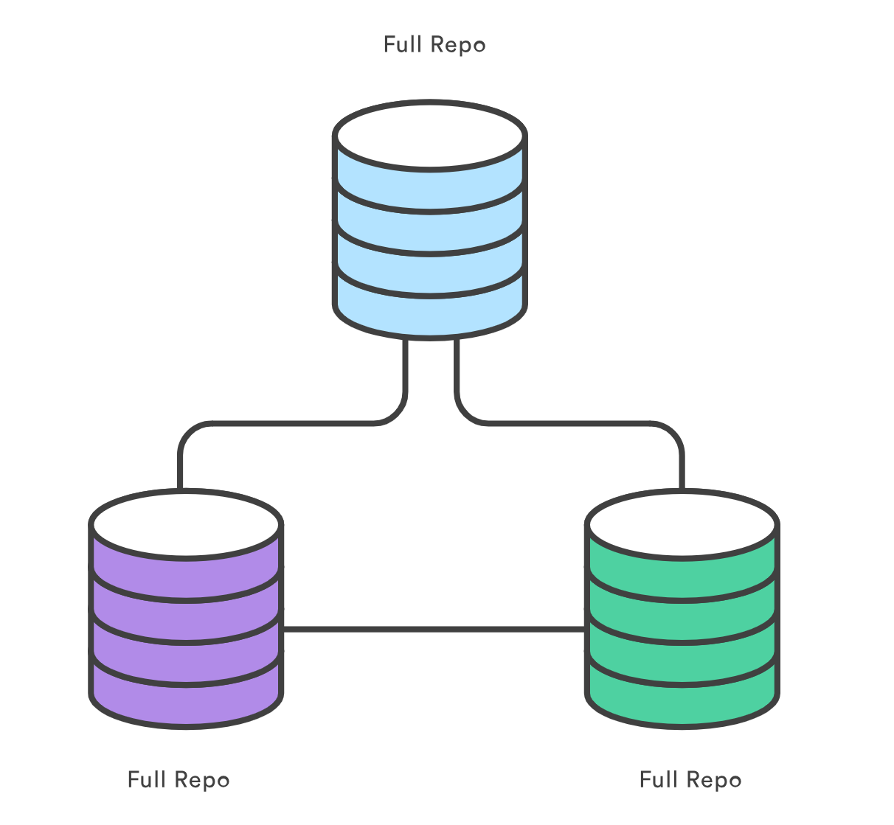
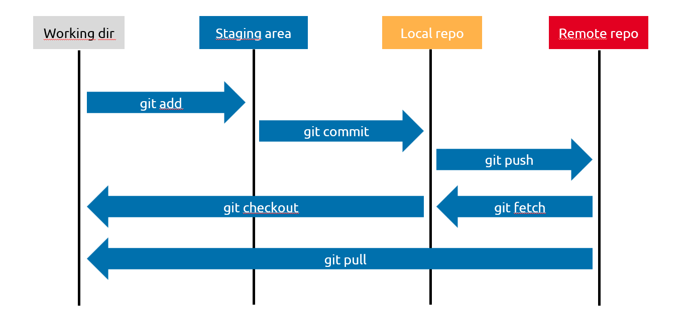
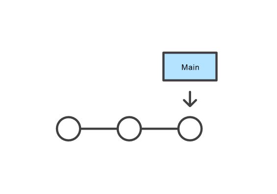
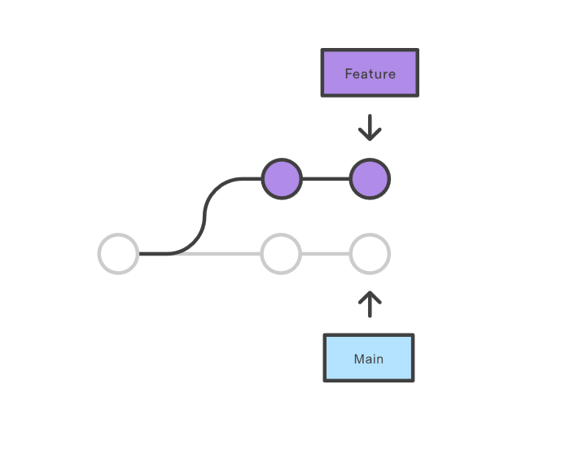
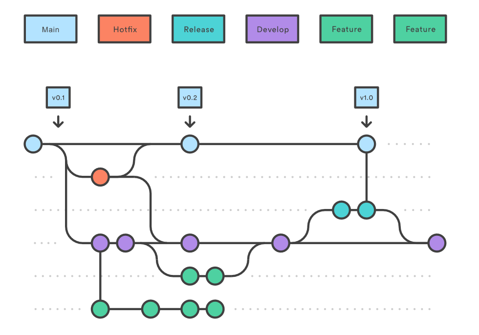

# GIT

- Théorie
   - Mode de fonctionnement
   - Workflow
   - Bonnes pratiques
- Pratique 
   - Revert et reset
   - Rebase et merge
   - Amend 
   - Au secours, il a commit avant moi !

## Théorie

### Mode de fonctionnement

|             centralisé            |     décentralisé                |
| --------------------------------- | ---------------------------     |
| client/serveur disctinct          |     client serveur non distinct |
|        branche = dossier          |        branche = référence      | 
|    |  |

cycle des lignes de commande git :

### Workflow

- Master only
   -  Pas adapter au travail collaboratif 
   -  Développement non isolé 
   -  Déploiement continue impossible 
   

- Feature branch
   -  Adapter au travail collaboratif 
   -  Développement isolé 
   -  Déploiement continu toujours impossible 

- Gitflow
   -  Adapter au travail collaborative 
   -  Développement isolé 
   -  Déploiement continue possible 

### Bonnes pratiques

- .gitignore (pas de fichier de conf de l'application, de votre IDE, de dépendance, ...)
- message de commit et nom de branche standardisé
- pas d'identifiant/mot de passe
- pas de code commenté 
- commit atomique

## Pratique

- Revert et reset : https://github.com/mchanimb/git-revert-and-reset ou https://gitlab.com/mchanimb/git-revert-and-reset
- Merge : https://github.com/mchanimb/git-merge ou https://gitlab.com/mchanimb/git-merge 
- Rebase et merge : https://github.com/mchanimb/git-rebase-and-merge ou https://gitlab.com/mchanimb/git-rebase-and-merge 
- Amend
- Au secours, il a commit avant moi !
